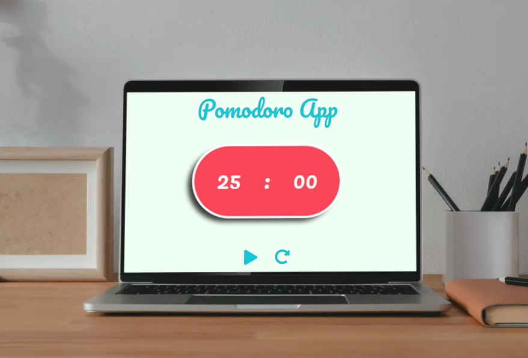

# COVID-19 WORLD DATA
> A simple application that shows a pomodoro-timer. Now you can manage your time with a low-size web app.

## Installation
 Just download the main folder and start the file index.html using your best browser.

## Usage example

With this app you can manage your time using the Pomodoro technique.

## Development setup and checklist

Just use CSS,Javascript and HTML5. And, of course, a good IDE.

- [X] Create a index.html
- [X] Build a good design usind CSS3
- [X] Implement the timer and sounds using JS

## Release History

* 0.1.0
    * The first proper release
* 0.0.1
    * Work in progress

## Meta

Marcel de Araújo Santos Souza – [My email](marcelaraujosantossouza19@gmail.com) - [My Linkedin](https://www.linkedin.com/in/marcel-santos-souza-bbbaa1191/)

Distributed under the MIT license. See ``LICENSE`` for more information.

## Contributing

1. Create a new pull request in your new branch!
